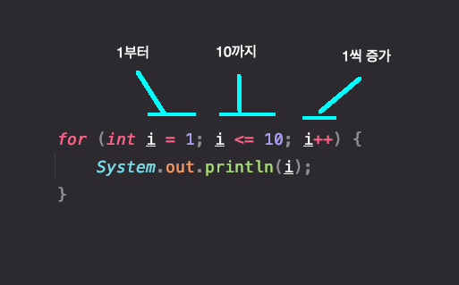

# 작성중
## WhiteShip Live Study 4주차. 제어문

---

## 목표
자바가 제공하는 제어문을 학습하세요.

## 학습할 것 (필수)
- 선택문
- 반복문

## 과제 (옵션)
- 과제 0. JUnit 5 학습하세요.  
- 과제 1. live-study 대시 보드를 만드는 코드를 작성하세요.
- 과제 2. LinkedList를 구현하세요.
- 과제 3. Stack을 구현하세요.
- 과제 4. 앞서 만든 ListNode를 사용해서 Stack을 구현하세요.
- 과제 5. Queue를 구현하세요.

---

## 제어문
코드의 실행흐름은 위에서 아래로 순차적으로 진행이 된다.  
그러나 때로는 조건에 따라 특정 문장을 반복하거나 건너뛰어야 할 필요성이 있다.  
이렇게 프로그램의 흐름을 바꿔주는 역할을 하는것이 **제어문**이다.

제어문은 조건문과 반복문이 있다.  

---

## 조건문

### if문
if문은 가장 기본적인 조건문이다.  
조건식이 true이면 블럭(괄호) 안의 문장을 수행하라는 의미이다.  
수행할 문장이 한 문장이라면 블럭은 생략할 수 있지만, 가독성이 떨어질 수 있으니 웬만하면 붙이도록 하자.   

```java
if (조건식) {
    System.out.println("if문에 들어왔다!");   // 조건식이 참이면 if문에 들어왔다! 를 출력한다.     
}
```

예를들어 이런식으로 사용할 수 있다.  

```java
if (age >= 20) {
    System.out.println("성인입니다.");    
}
```

여담으로 블럭 위치에 대한 스타일도 존재한다...  

```java
if (true)
{
    System.out.println("BSD");      // BSD 방식의 블럭
}

if (true) {
    System.out.println("K&R");      // K&R 방식의 블럭
}
```

### if-else문
else 즉 조건식의 결과가 false일 때 블럭안의 문장을 수행하라는 의미이다.  

```java
if (조건식) {
    System.out.println("조건식이 true이다!");
} else {
    System.out.println("조건식이 false이다!");
}
```

성인인지 아닌지 판별해야하는 경우 if문을 두번 사용하는 것보다 if-else문을 사용하는 것이 효율적이다.  
if문이 여러개면 항상 여러개의 조건식을 계산해야하지만 if-else문은 한번만 계산하면 되기 때문이다.  

```java
if (age >= 20) {
    System.out.println("성인입니다.");
}
if (age <= 19) {
    System.out.println("성인이 아닙니다.");
}

// 위의 코드를 if-else문으로 수정한다.

if (age >= 20) {
  System.out.println("성인입니다.");
} else {
  System.out.println("성인이 아닙니다.");
}
```

### if-else if문
처리 할 경우의 수가 세가지 이상인 경우에 사용할 수 있다.  

```java
if (score >= 90) {
    grade = "A";
} else if (score >= 80) {
    grade = "B";
} else if (score >= 60) {
    grade = "C";
} else {
    grade = "D"
}
```

첫번째 조건식부터 순서대로 계산을 해서 true인 조건식을 만나면 해당 블럭을 수행하고 if-else if문을 벗어난다.  
만약 모든 조건식이 false라면 else 블럭이 수행된다.  
이때 else 블럭은 필수 조건이 아니며, 모든 조건식이 false일때 else 블럭이 존재하지 않는다면 if-else if문의 어떤 블럭도 실행되지 않는다.  

### 중첩 if문
if문 내부에 if문을 포함시킬 수 있다.

```java
if (score >= 90) {
    if (score >= 95) {
        grade = "A+"
    } else if (score < 95) {
        grade = "A-";    
    } else {
        grade = "A";
    }
} else if (score >= 80) {
    if (score >= 85) {
        grade = "B+"
    } else {
        grade = "B";
    }
} else if (score >= 60) {
  grade = "C";
} else {
  grade = "D"
}
```

---

## 선택문

### switch문
switch문 혹은 switch-case문이라고 부른다.  
if문은 조건식 결과가 true와 false만 있기 때문에  
분기가 많아지면 복잡해지고, 느려진다.  
분기가 많다면 switch문을 사용해서 개선해보도록 하자.  

```java
int value = 1;

switch(value){
  case 1:
    System.out.println("1");
    break;
  case 2:
    System.out.println("2");
    break;
  case 3 :
    System.out.println("3");
    break;
  default :
      System.out.println("그 외의 숫자");
}
```

switch문의 블럭안의 조건식을 계산해 일치하는 case문으로 이동한다.  
문장을 수행하고, break문을 만나면 빠져나간다.  
만약 case1에서 break문이 없다면 case2로 넘어가서 2를 출력하고 break문을 만나 빠져나가게 된다.  
break문을 만나야만 혹은 switch문을 모두 수행해야 빠져나갈 수 있기 때문이다.  
예상못한 결과값을 얻을 수 있으니 주의해야 한다.  
default문은 if-else문의 else 블럭과 같은 역할을 한다.  

### switch문 제약조건
- switch문의 조건식은 정수 혹은 문자열이어야 한다.
- case문의 값은 정수, 상수, 문자열은 가능하지만 실수, 변수는 불가하다.
- case문의 값은 반드시 중복이 되지 않아야한다.

---

## 반복문
반복문은 특정 구간이 반복적으로 수행해야 될 때 사용된다.  
반복문의 종류는 for문, for-each문, while문, do-while문이 있다.  
for문과 while문은 유사한 구조를 가지고 있으며, 어느 경우에도 서로 변환을 할 수 있다.  
보통 반복 횟수를 알고 있다면 for문을, 모르는 경우에는 while문을 사용한다.  

### for문

  
<br>
위의 for문은 블록안의 문장을 10번 반복한다.  


---

## JUnit 5


