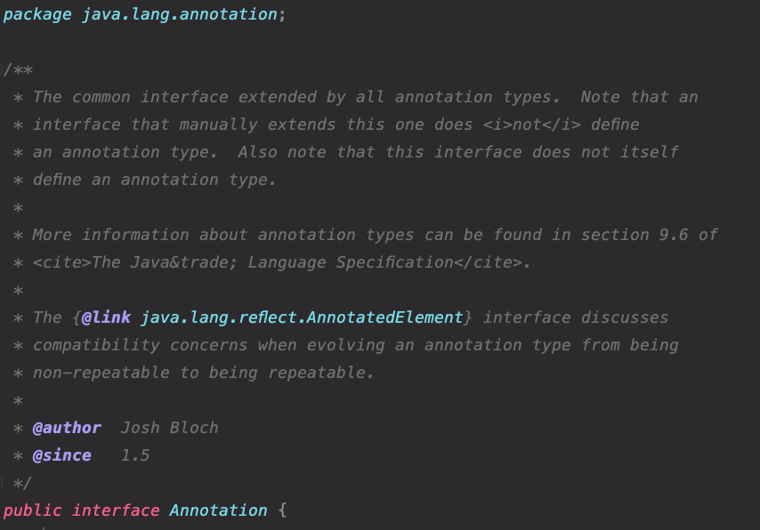
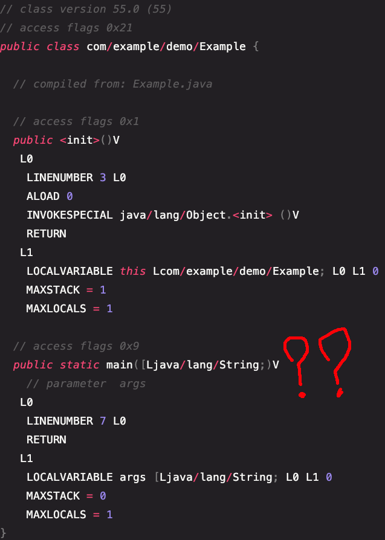
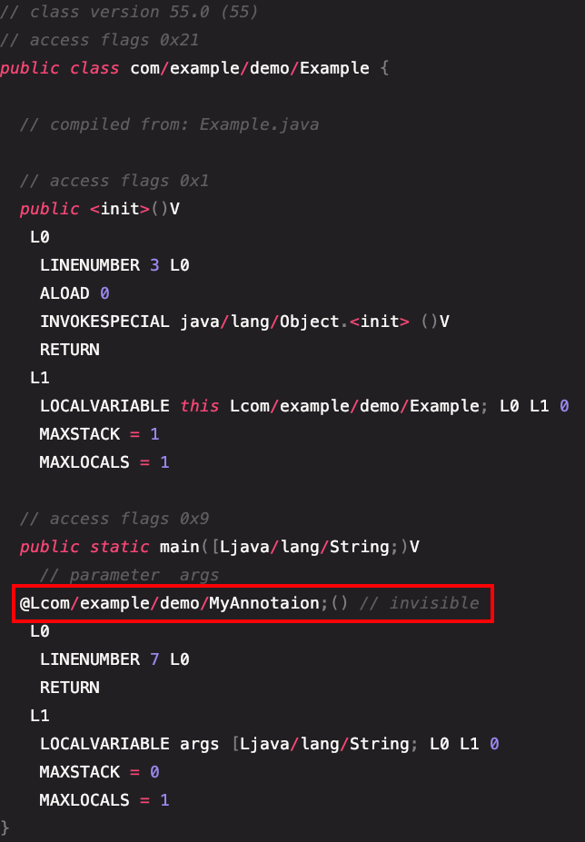
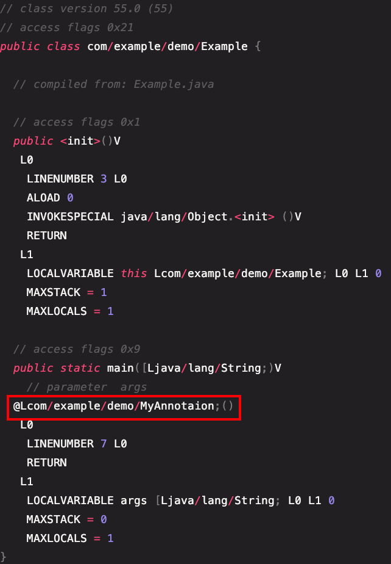
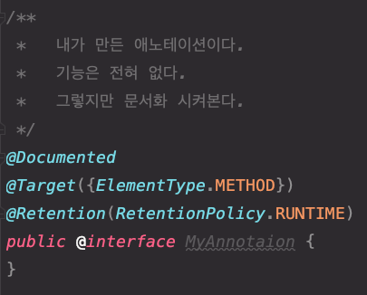
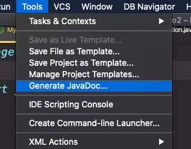
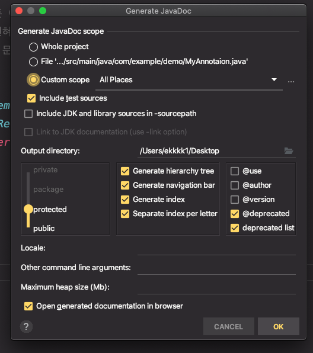
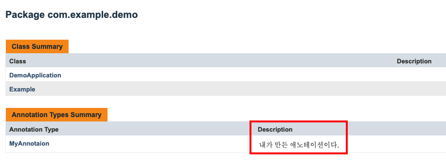
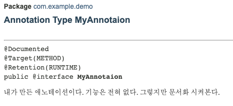
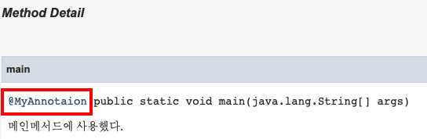

## WhiteShip Live Study 12주차. Annotation

---

## 목표
자바의 애노테이션에 대해 학습하세요.

## 학습할 것 (필수)
- 애노테이션 정의하는 방법
- @retention
- @target
- @documented
- 애노테이션 프로세서

---

### 애노테이션이란?

Annotation의 뜻은 **주석**이다.  
자바를 만든 개발자들은 소스코드에 대한 문서가 소스코드와 함께 포함되어 관리되는것이 좋다고 생각했다.  
그래서 소스코드의 주석으로부터 HTML 문서를 생성해내는 프로그램인 javadoc.exe를 만들어서 사용했다.

  

위와 같이 /* ~ */ 주석을 사용해서 말이다.  
'@'로 정의된 태그들을 이용해 주석 안의 정보를 저장하고, javadoc.exe 프로그램이 정보를 읽어서 문서를 작성한다.   
이 기능을 응용해서 프로그램의 소스코드 안에  
다른 프로그램을 위한 정보를 미리 약속된 형식으로 포함시킨 것이 바로 Annotation이다.  

---

### 애노테이션의 종류

애노테이션의 종류는 두가지로 나뉜다.  
- Meta Annotation
    - 애노테이션 위에 사용할 수 있는 애노테이션이다.  
    - @Retention, @Target, @Documented 등
- Composed Annotation
    - 한개 또는 여러개의 메타 애노테이션을 조합해서 만든 애노테이션이다.
    - @Override, @SuppressWarnings, @FunctionalInterface 등
    
---

### 애노테이션 정의하는 방법

애노테이션 정의는 정말 간단하다.  
```java
public @interface MyAnnotaion { }
```

위와 같이 만들어주면 애노테이션이 생성된다.  
현재는 주석과 비슷 의미의 애노테이션이지만  
여기서 필요에 따라 애노테이션 또는 인자값을 설정해주면  
간단하게 코드에 영향을 줄 수 있는 애노테이션이 된다.  

---

### @Retention

Retention 애노테이션은 해당 애노테이션의 정보를 어디까지 보유할지 설정해준다.  
RetentionPolicy 타입의 enum으로 설정할 수 있으며  
SOURCE, CLASS, RUNTIME 세 가지 종류가 있다.      
Retention 애노테이션을 사용하지 않는다면 CLASS가 기본값으로 설정된다.  
이제 세 가지 타입의 바이트 코드를 보면서 어떤점이 다른지 직접 확인해보겠다.  


- @Retention(RetentionPolicy.SOURCE)  
  애노테이션을 소스코드까지만 유지한다.  
  컴파일하면 해당 애노테이션의 정보는 날아간다.  
    
  ```java
  @Retention(RetentionPolicy.SOURCE)
  public @interface MyAnnotaion {}
  
  
  public class Example {
  
      @MyAnnotaion
      public static void main(String[] args) {
      }
      
  }
  ```
  
  RetentionPolicy.SOURCE를 사용한 애노테이션의 바이트 코드를 살펴보겠다.  
  
    
  
  메인 메서드를 아무리 봐도 @MyAnnotation의 대한 정보는 이미 사라지고 없어졌다.    
  

- @Retention(RetentionPolicy.CLASS)
  @Retention의 기본전략인 CLASS이다.  
  이름에서 감이 오는데, 컴파일 후 작성된 .class 파일까지 애노테이션이 유지된다.  
  그러나 런타임 시 해당 애노테이션은 제거된다.  
  
    
    
  
  이번엔 메인 메서드에 MyAnnotation이 있다!  
  그러나 우측 주석으로 invisible이라고 적혀있다.  
  컴파일 후 유지 되었지만 런타임 시 제거된다는 것을 알 수 있다.    
  
- @Retention(RetentionPolicy.RUNTIME)  

    

  메인 메서드에 MyAnnotation이 설정되었고, 옆에 visible이 적힌 주석도 없다.  
  즉 해당 애노테이션을 클래스를 메모리에 읽어왔을때까지 유지한다는 뜻이다.  
  주석의 용도가 아닌 로직에 사용되는 애노테이션은 Retention을 RUNTIME으로 설정한다.  

---

### @Target

@Target 은 해당 애노테이션이 어디에 사용할 수 있는지 결정한다.  
ElementType 타입의 enum으로 설정할 수 있다.  
종류는 다음과 같다.  

```java
TYPE, FIELD, METHOD, PARAMETER, CONSTRUCTOR, LOCAL_VARIABLE, 
ANNOTATION_TYPE, PACKAGE, TYPE_PARAMETER, TYPE_USE, MODULE
```

종류가 굉장히 많다.  
ANNOTATION_TYPE을 사용하면 앞서 말했던 메타 애노테이션이 되고,  
METHOD를 사용하면 메서드에만 해당 애노테이션을 사용할 수 있다.  
배열을 사용할 수 있어 여러개의 타입을 선언할 수 있다.  

---

### @Documented

javadoc에 해당 애노테이션을 사용한 코드의 문서에 애노테이션 정보를 표기할지 결정한다.  
사실 javadoc을 이렇게 만들 수 있는지 처음 알았다.  
잘 사용하면 유용하게 사용할 수 있을 것 같다.  

  

MyAnnotation에 @Documented를 사용했다.  
인텔리제이 기준 아래와 같이 javadoc을 만들 수 있다.  

  

  

이렇게 간단하게 만들 수 있다.  
만들고 난 후엔 이런 HTML 파일이 생성되고 

```java
/**
 *
 */
```

위와 같은 주석을 사용하면 Description을 작성할 수 있다.  

  

  

@Documented를 사용한 애노테이션을 사용하면 아래와 같이 javadoc에 표기가 된다.  

  

---

### 애노테이션 프로세서

애노테이션 프로세서는 컴파일 단계에서 소스를 조작할 수 있다.  
Lombok, JPA 등 많은 라이브러리에서 사용된다.  

### 애노테이션 프로세서 장점과 단점

- 장점 : 바이트코드를 조작한다는 것은 런타임시 발생되어 비용이 발생하지만,  
        애노테이션 프로세서는 컴파일시 조작이 되어 런타임에 대한 비용이 발생하지 않는다.
- 단점 (Lombok) : 공개된 API가 아닌 컴파일러 내부 클래스를 사용해서 코드를 조작한다. (약간의 해킹이라고 볼 수 있다.)   
        내부 API는 언제든 변경될 수 있기 때문에 위험할 가능성이 존재한다.  

---

# 참고
[선장님 - 인프런 강의 더 자바, 코드를 조작하는 다양한 방법](https://www.inflearn.com/course/the-java-code-manipulation?inst=c160e128)  
[남궁성 - 자바의 정석](http://www.yes24.com/Product/Goods/24259565)  

---


